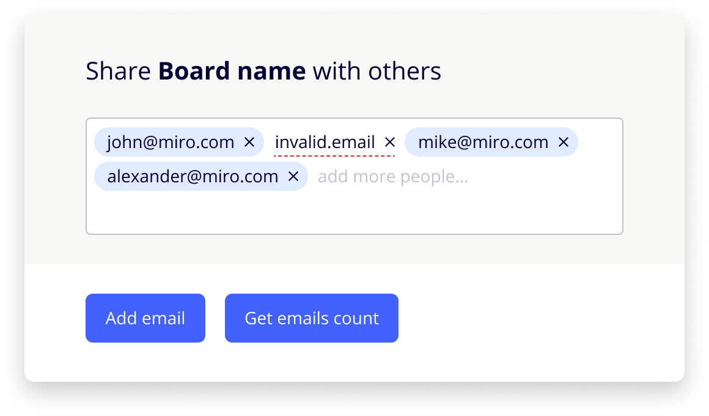

# ✉️ Emails Input
Small js library with input for multiple emails.
## 🚀 [Demo](http://mazeinadia.github.io/emails-input/)


Source code in [demo folder]()

---
## ⚙ Setup

### Install
Using `npm`

```bash
npm install 
```

### Add script

```html
<script src=""></script>
```

## ✉️ Usage

### Basic usage

```javascript
<div id="emails-input"></div> 
<script src="emails-input.js"></script> 
<script> 
    var inputContainerNode = document.querySelector('#emails-input'); 
    var emailsInput = EmailsInput(inputContainerNode); 
</script>
```

### Advanced

emailInput = EmailsInput(container, name, options);

Parameters:

| parameter | required | type | description | example |
|---|---|---|---|---|
| container | + | HTMLElement | element to wrap Emails Input | document.querySelector('body') |
| options | - |  |  |  |
| options.value | - | string[] |  | ['john@gmail.com'] |
| options.onChange | - | ({ id: number, value: string, valid: boolean }[]) => void | callback for change Emails Input value | (values) => { console.log(values) } |

Returns HTMLElement - wrapper of component

### Browser supports
 - IE11+
 - Edge latest
 - Chrome latest
 - FF latest
 - Safari latest
 
## 💻 Development
### Setup
Install all dependencies:

```bash
npm i
```
Run rollup and dev server in watch mode:

```bash
npm run dev
```
This will run local-server, build to dist directory and automatically refresh page on any changes (it loads content from demo folder).
 
### Testing
For integration tests you need to run dev server:
 ```bash
npm run dev
```
and run test with command:
```bash
npm run test
```

### [Design in Figma](https://www.figma.com/file/CWdAs3rN4d2gZpnoN7ZPvj/Share-test)